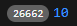

# Tugas Praktikum - Week 3


## Praktikum 1
```
String test = "test2";
  if (test == "test1") {
    print("Test1");
  } else if (test == "test2") {
    print("Test2");
  } else {
    print("Something else");
  }

  if (test == 'test2') print("Test2 again");
```
  
Kode diatas menunjukkan perbedaan dari penggunaan if, pada blok if terakhir di kode program, dapat disederhanakan sehingga muat dalam satu baris.
```
String test2 = "true";
  if (test2) {
    print("Kebenaran");
  }
``` 
Kode diatas akan menghasilkan error,   
Perbaikan:
```
String test2 = "true";
  if (test2 == "true") {
    print("Kebenaran");
  }
```

## Praktikum 2
```
void main(List<String> args) {
  while (counter < 33) {
    print(counter);
    counter++;
  }
}
```
  
Program diatas akan menghasilkan error "undefined name 'counter'" hal ini terjadi karena kita belum mendefinisikan variabel 'counter'.  
Perbaikan:  
```
int counter = 0;

  while (counter < 33) {
    print(counter);
    counter++;
  }
```
  
Tambahkan kode sehingga menjadi seperti berikut
```
void main(List<String> args) {
  int counter = 0;

  while (counter < 33) {
    print(counter);
    counter++;
  }

  print(" ");
  do {
    print(counter);
    counter++;
  } while (counter < 77);
}
```

## Praktikum 3
```
for (Index = 10; index < 27; index) {
  print(Index);
}
```
  

Kode diatas akan menghasilkan error berupa undefined variabel pada 'index'. Selain itu jika kode telah dibetulkan dan dijalankan maka akan melakukan looping non stop, hal ini disebabkan karena bagian kontrol statement yang tidak lengkap.  
pada langkah ke-3 dilakukan penambahan kode sebagai berikut
```
void main(List<String> args) {
  for (int index = 10; index < 27; index++) {
    if (index == 21) break;
    else if(index > 1 || index < 7) continue;
    print(index);
  }
}
```

Kode diatas tidak akan menghasilkan output apapun, hal ini disebabkan oleh  
 `else if(index > 1 || index < 7) continue;`  
 Dengan `||` OR maka kondisi akan selalu benar untuk semua index, sehingga baris selanjutnya tidak akan pernah dieksekusi.  
Sehingga saya ubah menjadi sebagai berikut `else if(index > 1 && index < 7) continue;` dengan `&&`.

## Tugas Praktikum
Buatlah sebuah program yang dapat menampilkan bilangan prima dari angka 0 sampai 201 menggunakan Dart. Ketika bilangan prima ditemukan, maka tampilkan nama lengkap dan NIM Anda.

```
void main(List<String> args) {
  String nama = "Fabian Hasbillah";
  String nim = "2341720170";

  for (int i = 0; i < 201; i++) {
    if (isPrime(i)) print("Angka Prima : $i | Nama : $nama | Nim : ($nim)");
    print(i);
  }
}

  bool isPrime(int n) {
    if (n < 2) return false;
    for (int i = 2; i * i <= n; i++) {
      if (n % i == 0) return false;
    }
    return true;
  }
```
