# Tugas Praktikum Minggu ke-4

## Praktikum 1 
```
void main(List<String> args) {
  // Langkah 1
  var list = [1,2,3];
  assert(list.length == 3);
  assert(list[1] == 2);
  print(list.length);
  print(list[1]);

  list[1] = 1;
  assert(list[1] == 1);
  print(list[1]);
}
```
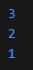  
Praktikum di atas melakukan inisiasi list, serta melakukan check value menggunakan `assert()`, dan mengubah data yang tersimpan di list tersebut.

```
  // Langkah 2
  final List<String?> list1 = List.filled(5, null);
  list1[1] = "Fabian Hasbillah";
  list1[2] = "2341720170";
  for (var i in list1) print(i);
```
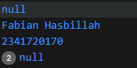  

## Praktikum 2 
```
  // Langkah 1 
  var halogens = {'fluorine', 'chlorine', 'bromine', 'iodine', 'astatine'};
  print(halogens);
```
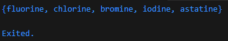
Kode di atas melakukan inisialisasi pada set halogens, kemudian melakukan print.
```
  // Langkah 3
  var names1 = <String>{};
  Set<String> names2 = {}; // This works, too.
  var names3 = {}; // Creates a map, not a set.

  print(names1);
  print(names2);
  print(names3);
```
Tidak ada error dari kode diatas, namun var names3 bukan termasuk ke dalam set, melainkan merupakan sebuah map.  
Tambahkan elemen nama dan NIM Anda pada kedua variabel Set tersebut dengan dua fungsi berbeda yaitu `.add()` dan `.addAll()`.  
```
  var names1 = <String>{};
  Set<String> names2 = {}; // This works, too.
  var names3 = {}; // Creates a map, not a set.

  var name = {'Fabian', 'Hasbillah'};

  names1.addAll(name);
  names1.add('2341720170');
  print(names1);
  print(names2);
  print(names3);
```


## Praktikum 3
```
  // Langkah 1
  var gifts = {
    // Key:    Value
    'first': 'partridge',
    'second': 'turtledoves',
    'fifth': 1
  };

  var nobleGases = {
    2: 'helium',
    10: 'neon',
    18: 2,
  };

  print(gifts);
  print(nobleGases);
```
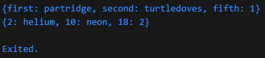
Kode diatas tidak terjadi error walaupun ada string dan int dalam satu kolom, hal ini terjadi karena saat kita mendeklarasi dengan tipe data var, dart secara otomatis menyesuaikan tipe data dari setiap kolom. Dari contoh praktikum diatas dart mendeklarasi dengan tipe data sebagai `_Map<String, Object>` untuk gifts, dan `_Map<int, Object>` untuk nobleGases.
```
  // Langkah 3
  var mhs1 = Map<String, String>();
  gifts['first'] = 'partridge';
  gifts['second'] = 'turtledoves';
  gifts['fifth'] = 'golden rings';

  var mhs2 = Map<int, String>();
  nobleGases[2] = 'helium';
  nobleGases[10] = 'neon';
  nobleGases[18] = 'argon';
```
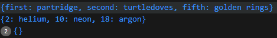
Kode di atas mendeklarasi set bersamaan dengan tipe data yang dibawa, serta menginisialisasi data baru untuk set gifts dan nobleGases.  

Tambahkan elemen nama dan NIM Anda pada tiap variabel di atas (gifts, nobleGases, mhs1, dan mhs2).
```
  gifts['2341720170'] = "Fabian Hasbillah";
  nobleGases[2341720170] = "Fabian Hasbillah";
  mhs1['2341720170'] = "Fabian Hasbillah";
  mhs2[2341720170] = "Fabian Hasbillah";
```
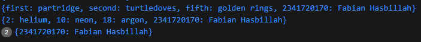

## Praktikum 4
```
  // Langkah 1
  var list = [1, 2, 3];
  var list2 = [0, ...list];
  print(list);
  print(list2);
  print(list2.length);
```
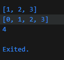
List2 menggunakan spread operator untuk mengambil data dari var list yang kemudian ditambahkan ke dirinya sendiri.

```
  // Langkah 3
  var list1 = [1, 2, null];
  print(list1);
  var list3 = [0, ...?list1];
  print(list3);
  print(list3.length);
```
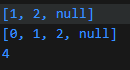
Kurang lebih sama dengan praktikum sebelumnya, hanya saja di sini terdapat list dengan data null, kemudian dilakukan pengecekan `...?` yang mana hanya menambahkan data jika data yang di maksudkan tidak null. Dalam kasus ini list1 tidaklah null (masih ada data) sehingga operator tersebut redundant.  

Tambahkan variabel list berisi NIM Anda menggunakan Spread Operators. Dokumentasikan hasilnya dan buat laporannya!
```
  var nimNama = [2341720170, 'Fabian Hasbillah'];
  var listGabungan = [10, ...nimNama];
  print(listGabungan);
```


```
  // Langkah 4
  bool promoActive = true;
  var nav = ['Home', 'Furniture', 'Plants', if (promoActive) 'Outlet'];
  print(nav);

  bool promoActive = false;
  var nav = ['Home', 'Furniture', 'Plants', if (promoActive) 'Outlet'];
  print(nav);
```
- True 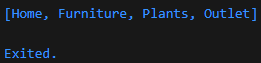
- False 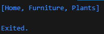  
```
  // Langkah 5
  var login = 'Manager';
  var nav2 = ['Home', 'Furniture', 'Plants', if (login case 'Manager') 'Inventory'];
  print(nav2);
```
- `login = 'Manager'`  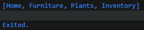
- `login != 'Manager'`  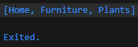
```
  // Langkah 6
  var listOfInts = [1, 2, 3];
  var listOfStrings = ['#0', for (var i in listOfInts) '#$i'];
  assert(listOfStrings[1] == '#1');
  print(listOfStrings);
```
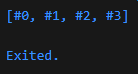
Collection For adalah fitur di Dart yang memungkinkan kita menulis loop langsung di dalam literal koleksi (List, Set, atau Map).

## Praktikum 5
```
  // Langkah 1
  var record = ('first', a: 2, b: true, 'last');
  print(record);
```
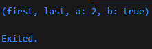
Hasil dikelompokkan dari beberapa nilai menjadi satu, yang diurutkan berdasarkan positional field, dan/atau named field.  
```
  // Langkah 3
  (int, int) tukar((int, int) record) {
    var (a, b) = record;
    return (b, a);
  }
  var angka = (1, 2);
  var changed = tukar(angka);
  print(changed);
```
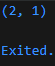  
```
  // Langkah 4
  (String, int) mahasiswa = ("Fabian Hasbilah", 2341720170);
  print(mahasiswa);
```
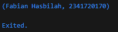  
```
  // Langkah 5
  var mahasiswa2 = ('first', a: 2341720170, b: "Fabian Hasbillah", 'last');

  print(mahasiswa2.$1); // Prints 'first'
  print(mahasiswa2.a); // Prints 2
  print(mahasiswa2.b); // Prints true
  print(mahasiswa2.$2); // Prints 'last'
```
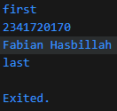 

## Soal Praktikum
  2. Jelaskan yang dimaksud Functions dalam bahasa Dart!  
      Fungsi adalah blok kode yang dapat dipanggil dan gunakan berulang kali.
  3. Jelaskan jenis-jenis parameter di Functions beserta contoh sintaksnya!  
      + Potitional Parameter (parameter wajib yang harus diinputkan ketika memanggil function), ditulis berurutan dalam ()  
      + Optional parameter, parameter yang tidak wajib diinputkan ditaruh di dalam []  
      + Named parameter, parameter yang harus menyebutkan nama parameternya saat memanggil function
  4. Jelaskan maksud Functions sebagai first-class objects beserta contoh sintaknya!  
      Fungsi bisa disimpan di varabel, fungsi bisa dikirim sebagai parameter ke fungsi lain, fungsi bisa dikembalikan dari fungsi lain
      + Contoh fungsi disimpan di variabel  
        ```
        void sapa(String nama) {
          print("Halo, $nama!");
        }

        void main() {
          // simpan fungsi ke variabel
          var greet = sapa;  
          greet("Budi"); // Output: Halo, Budi!
        }
        ```
      + Contoh fungsi sebagai parameter  
        ```
        void prosesAngka(int a, int b, int Function(int, int) operasi) {
          print("Hasil: ${operasi(a, b)}");
        }

        int tambah(int x, int y) => x + y;
        int kali(int x, int y) => x * y;

        void main() {
          prosesAngka(3, 4, tambah); // Output: Hasil: 7
          prosesAngka(3, 4, kali);   // Output: Hasil: 12
        }

        ```
      + Fungsi mengembalikan fungsi
        ```
        Function buatPengali(int faktor) {
          return (int angka) => angka * faktor;
        }

        void main() {
          var kaliDua = buatPengali(2);
          var kaliTiga = buatPengali(3);

          print(kaliDua(5)); // Output: 10
          print(kaliTiga(5)); // Output: 15
        }

        ```
  5. Apa itu Anonymous Functions? Jelaskan dan berikan contohnya!  
  Fungsi anonim adalah fungsi tanpa nama, contoh  
  ```
  // normal function
  int penjumlahan (int a, int b){
    return a + b;
  }

  // anonimus function
  (parameter1, parameter2, ...) {
    // body function
    return hasil;
  };
  ```
  6. Jelaskan perbedaan Lexical scope dan Lexical closures! Berikan contohnya!  
     - Lexical scope = ruang lingkup variabel ditentukan oleh posisi kode saat ditulis (compile time), bukan saat dijalankan.
     - Closure = fungsi yang “membawa” scope tempat dia dibuat, bahkan setelah scope itu selesai dieksekusi, Contoh  
        ```
          Function buatPenghitung() {
            var hitung = 0;

            // ini closure
            return () {
              hitung++;
              return hitung;
            };
          }

          void main() {
            var counter1 = buatPenghitung();
            print(counter1()); // 1
            print(counter1()); // 2
            print(counter1()); // 3

            var counter2 = buatPenghitung();
            print(counter2()); // 1 (punya scope sendiri)
          }

        ```
  7. Jelaskan dengan contoh cara membuat return multiple value di Functions!
  ```
    List<int> hitung(int a, int b) {
      return [a + b, a - b, a * b];
    }

    void main() {
      var hasil = hitung(10, 5);
      print("Tambah: ${hasil[0]}, Kurang: ${hasil[1]}, Kali: ${hasil[2]}");
      
      // Hasil print "Tambah: 15, Kurang: 5, Kali: 50"
    }
  ```