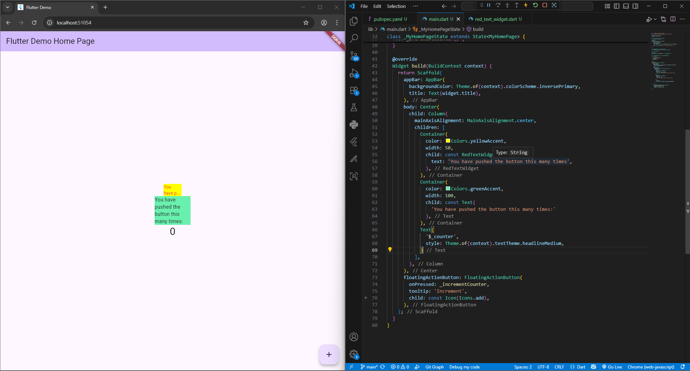

# Praktikum Menerapkan Plugin di Project Flutter

1. Praktikum
      

2. Jelaskan maksud dari langkah 2 pada praktikum tersebut.  
    `flutter pub add auto_size_text` kode tersebut dijalankan di terminal untuk menginstall dependensi serta package untuk menjalankan fungsi auto_size_text.  

3. Jelaskan maksud dari langkah 5 pada praktikum tersebut!
    Langkah 5 merupakan kode pelengkap dari langkah pembuatan class RedTextWidget sebelumnya. Pada langkah 4 dilakukan pemanggilan variabel text yang mana sebelumnya belum ada di parameter class tersebut. Sehingga di langkah 5 inilah kita melakukan deklarasi variabel tersebut.  

4. Pada langkah 6 terdapat dua widget yang ditambahkan, jelaskan fungsi dan perbedaannya!
    terdapat 2 widget satunya menggunakan fungsi `RedTextWidget()` yang didalamnya telah terpasang plugin `auto_size_text` dan satunya lagi menggunakan fungsi `Text()` biasa. Pada text yang menggunakan `RedTextWidget()` text ditampilkan maksimal dalam 2 baris.  

5. Jelaskan maksud dari tiap parameter yang ada di dalam plugin auto_size_text berdasarkan tautan pada dokumentasi ini !
    ```
    AutoSizeText(
        String data, {
        Key? key,
        Key? textKey,
        TextStyle? style,
        StrutStyle? strutStyle,
        double minFontSize = 12,
        double maxFontSize = double.infinity,
        double stepGranularity = 1,
        List<double>? presetFontSizes,
        AutoSizeGroup? group,
        TextAlign? textAlign,
        TextDirection? textDirection,
        Locale? locale,
        bool? softWrap,
        bool wrapWords = true,
        TextOverflow? overflow,
        Widget? overflowReplacement,
        double? textScaleFactor,
        int? maxLines,
        String? semanticsLabel,
        })
    ```
    - data (String) -> Teks yang ingin ditampilkan oleh widget  
    - key (Key?) -> Key untuk widget AutoSizeText itu sendiri  
    - textKey (Key?) -> Key khusus yang diteruskan ke widget Text internal  
    - style (TextStyle?) -> Gaya teks dasar: font size, warna, weight, dsb.  
    - strutStyle (StrutStyle?) -> Menetapkan strut style — yaitu pengaturan vertikal seperti tinggi baris minimum, leading, dll  
    - minFontSize (double (default = 12)) -> Ukuran font minimum yang diperbolehkan ketika auto-size mencoba mengecilkan teks agar muat  
    - maxFontSize (double (default = double.infinity)) -> Ukuran font maksimum yang boleh digunakan ketika auto‐size menaikkan teks agar lebih besar  
    - stepGranularity (double (default = 1)) -> Langkah (increment) ukuran font saat melakukan penyesuaian  
    - presetFontSizes (List<double>?) -> Daftar ukuran font yang diizinkan (preset) — mekanisme alternatif ke stepGranularity  
    - group (AutoSizeGroup?) -> Untuk menyinkronkan ukuran font di antara beberapa AutoSizeText agar semuanya menggunakan ukuran yang sama dalam satu grup  
    - textAlign (TextAlign?) -> Penyelarasan horizontal (kiri, tengah, kanan, justify)  
    - textDirection (TextDirection?) -> Arah teks (LTR atau RTL)  
    - locale (Locale?) -> Locale yang digunakan untuk merender teks — mempengaruhi pilihan font atau aturan bahasa  
    - softWrap (bool?) -> Apakah teks boleh dibungkus (wrap) di titik-titik lunak (soft breaks)  
    - wrapWords (bool (default = true)) -> Jika sebuah kata tidak muat dalam satu baris, apakah kata itu boleh dibagi (dipotong) dan dibungkus ke baris berikutnya  
    - overflow (TextOverflow?) -> Bagaimana menangani teks jika setelah penyesuaian ukuran masih overflow  
    - overflowReplacement (Widget?) -> Jika overflow tidak bisa dihindari, widget alternatif yang akan ditampilkan  
    - textScaleFactor (double?) -> Faktor skala teks (misal dari pengaturan pengguna)  
    - maxLines (int?) -> Batas maksimal baris yang diizinkan  
    - semanticsLabel (String?) -> Label semantik untuk pembaca layar — jika kamu ingin teks yang ditampilkan berbeda dari apa yang dibaca secara aksesibilitas